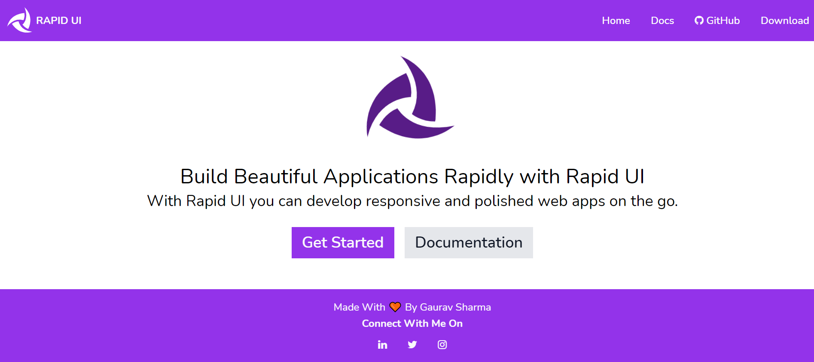

# Rapid UI - A CSS Component Library
Rapid UI is a CSS Component library developed during the course of neoG camp. With Rapid UI you can develop responsive and polished web apps on the go.



## Getting Started

You can use the following template for using this library :-
```
<html lang="en">
  <head>
      <meta charset="UTF-8">
      <meta http-equiv="X-UA-Compatible" content="IE=edge">
      <meta name="viewport" content="width=device-width, initial-scale=1.0">
      <title>Title</title>
      <link rel="stylesheet" href="https://gaurav-sharma-component-lib.netlify.app/style.css"/>
  </head>    
  <body>


  <script type="text/javascript" src="https://gaurav-sharma-component-lib.netlify.app/rapid-ui.js"></script>
  </body>
</html>
```

Or you can manually add the following files in your project - 
Add the following files :
1. Add the external CSS on the respective HTML page.
```html
  <link rel="stylesheet" 
  href="https://gaurav-sharma-component-lib.netlify.app/style.css"/>
```
2. Add the JavaScript for certain components which needs an action and outcome.
```HTML
  <script type="text/javascript" 
  src="https://gaurav-sharma-component-lib.netlify.app/rapid-ui.js">
  </script>
```
> Note: Add the JavaScript code snippet just at the end of `</body>` such that all the components work well.

## Use deployed documentation for reference - [Rapid UI](https://rapid-ui.netlify.app/)
